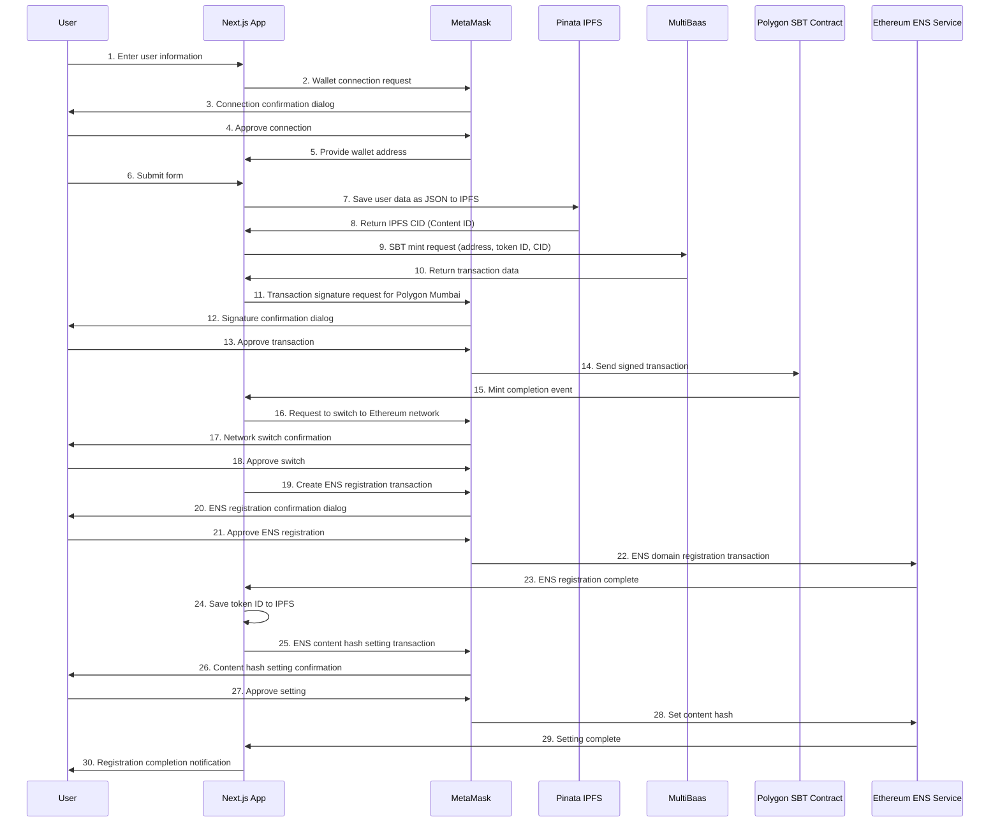

# Hello-app: SBT Blockchain System with ENS Integration

## Concept

This project is an innovative solution that prioritizes privacy while ensuring the credibility of digital identities. By leveraging the concept of Soul Bound Tokens (SBT), it creates user-specific, non-transferable digital identities on the blockchain.

Key concepts include:

- **Decentralized Identity**: A self-sovereign digital ID system that doesn't rely on central administrators
- **Multi-chain Architecture**: Design that leverages the advantages of both Polygon (speed and low cost) and Ethereum (security and compatibility)
- **On-chain Data Management**: Privacy protection through distributed storage using IPFS
- **ENS Integration**: Human-readable identity reference system
- **Physical World Connection**: Future integration with NEC cards to bridge online and offline environments

This system provides a new option for companies and organizations to manage user authentication and membership. Instead of relying on traditional centralized databases, users retain ownership of their data while providing verifiable credibility.

## Overview

This project is an identity management system utilizing blockchain technology with the following key features:

1. **Soul Bound Token (SBT) Minting**: Issues NFTs containing user information, but unlike regular NFTs, these function as "soul-bound" tokens that cannot be transferred (implemented on Polygon)
2. **ENS (Ethereum Name Service) Integration**: Links SBT metadata to ENS domains (implemented on Ethereum)
3. **NEC Card Writing**: Future support for writing information to NEC cards

## System Architecture

This project uses Docker Compose to configure the following services:

- **NextJS**: Frontend application (React/TypeScript)
- **Nginx**: Web server

## Technology Stack

- **Frontend**: Next.js, React, TypeScript, TailwindCSS
- **Blockchain**: 
  - Polygon (Mumbai Testnet) - For SBT contracts
  - Ethereum (Sepolia Testnet) - For ENS functionality
- **Smart Contract**: SoulBoundToken (Non-transferable token based on ERC-721)
- **Smart Contract Interface**: MultiBaas
- **Distributed Storage**: IPFS (using Pinata)
- **ENS**: Ethereum Name Service (Domain management)
- **Web Server and Reverse Proxy**: Nginx
- **Containerization**: Docker, Docker Compose

## Main Application Screens

The application consists of the following main screens:

### 1. Wallet Connect Screen (`nextjs/src/app/page.tsx`)

This is the entry point of the application. Users connect their wallet (such as MetaMask) here and authenticate with the blockchain network. It features a simple interface focused on wallet connection and directs users to the registration page after successful authentication.

### 2. Registration Screen (`nextjs/src/app/register/page.tsx`)

This is the central screen for entering user information and minting SBTs. It provides the following functions:
- Input of user profile information (name, company, email, etc.)
- Data storage on IPFS
- SBT minting (on Polygon)
- ENS domain registration and content hash setting (on Ethereum)

### 3. Dashboard Screen (`nextjs/src/app/dashboard/page.tsx`)

This screen is accessible after users mint their SBT and displays the following information:
- List and preview of minted NFTs
- Transaction history
- Activity log (network connections, minting operations, etc.)
- Navigation links to the home screen

### 4. Profile Screen (`nextjs/src/app/profile/page.tsx`)

This screen displays detailed profile information about the user, including:
- Visual representation of the user's NFT
- Basic information (name, company, email, phone number, etc.)
- Profile text
- Wallet address information
- Links to profile editing functionality

### 5. Common Components

Key components that are reused throughout the application:

- **WalletConnect** (`nextjs/src/app/components/WalletConnect.tsx`): Manages connection with MetaMask, handling wallet address retrieval and authentication.

- **Navigation** (`nextjs/src/app/components/Navigation.tsx`): Provides a navigation bar for moving between different screens within the application.

## Setup

### Prerequisites

- Docker and Docker Compose installed
- Ethereum wallet such as MetaMask
- Test tokens for multiple chains:
  - MATIC on Polygon Mumbai Testnet (for SBT issuance)
  - ETH on Sepolia Testnet (for ENS registration)
  (These can be obtained from test faucets)

### Installation Steps

1. Clone the repository:

```bash
git clone https://github.com/Kosuke-Mega/hello-app-test.git
cd hello-app-test
```

2. Configure the environment variables file:

```bash
cp .env.local.new .env.local
```

3. Start containers with Docker Compose:

```bash
docker-compose up -d
```

4. Access the application in your browser at `http://localhost:80`

### Environment Variables

You can configure the following environment variables in the `.env.local` file:

- `NEXT_PUBLIC_MULTIBAAS_DEPLOYMENT_URL`: MultiBaas deployment URL
- `NEXT_PUBLIC_MULTIBAAS_CHAIN_ID`: Blockchain chain ID (default is Sepolia: 11155111)
- `NEXT_PUBLIC_MULTIBAAS_VOTING_ADDRESS_ALIAS`: SBT contract address
- `NEXT_PUBLIC_MULTIBAAS_VOTING_CONTRACT_LABEL`: SBT contract label

## System Flow

1. **Wallet Connection**: Connect an Ethereum wallet such as MetaMask
2. **User Information Registration**: Input name, company, email, and other information
3. **IPFS Storage**: Save user information to IPFS and retrieve a Content ID (CID)
4. **SBT Minting**: Mint an SBT to the user's wallet address
5. **ENS Registration**: Register an ENS domain and associate the SBT token ID as metadata

## Multi-chain Architecture

This project utilizes two different blockchains:

1. **Polygon (Mumbai Testnet)**: Used for issuing and managing SBTs. Polygon's low gas fees and high scalability enable efficient token issuance even as the number of users increases.

2. **Ethereum (Sepolia Testnet)**: Used for ENS domain registration and content hash setting. It leverages Ethereum's robustness and security while utilizing the existing ENS infrastructure.

This multi-chain approach creates a system design that takes advantage of each blockchain's strengths. Users need to switch networks in MetaMask during the process, but the application guides them through this.

## ENS and IPFS Integration

In this system, the CID of user data stored on IPFS is registered as an ENS domain content hash. This enables access to user identity information in a verifiable way on the blockchain.

Specific flow:

1. Store user information as JSON on IPFS
2. Encode the returned CID into ENS content hash format
3. Register a randomly generated ENS subdomain
4. Set the content hash to the domain via the ENS resolver

## Register Flow (Sequence Diagram)



## Key Code Components

### Frontend

- `nextjs/src/app/page.tsx`: Main page component
- `nextjs/src/app/register/page.tsx`: User registration page component
- `nextjs/src/app/components/WalletConnect.tsx`: Wallet connection component

### Smart Contract Integration

- `nextjs/src/app/register/abi/`: Smart contract ABI (Application Binary Interface)
- `nextjs/src/app/register/app/cidEncode.ts`: Utility for converting IPFS CID to ENS content hash

### Infrastructure

- `docker-compose.yml`: Docker container configuration
- `nginx/`: Nginx configuration files

## Developer Information

### Directory Structure

```
hello-app-test/
├── docker-compose.yml     # Docker container configuration
├── nextjs/                # Next.js application
│   ├── Dockerfile         # Dockerfile for Next.js
│   ├── public/            # Static files
│   ├── src/               # Source code
│   │   ├── app/           # Next.js app directory
│   │   │   ├── api/       # API routes
│   │   │   ├── components/# Common components
│   │   │   ├── register/  # Registration page
│   │   │   │   ├── abi/   # Contract ABIs
│   │   │   │   ├── app/   # Utilities
│   │   │   │   └── page.tsx # Registration page component
│   │   │   └── page.tsx   # Main page component
│   │   └── types/        # TypeScript type definitions
├── nginx/                # Nginx configuration
│   ├── Dockerfile        # Dockerfile for Nginx
│   ├── default.conf      # Nginx site configuration
│   └── nginx.conf        # Nginx basic configuration
```

### API Integration

This application primarily integrates with the following APIs:

1. **Pinata API**: Used to store metadata on IPFS
2. **MultiBaas API**: Used as an integration layer for smart contract operations. MultiBaas abstracts blockchain infrastructure and enables seamless interaction with smart contracts through a RESTful API
3. **MetaMask**: Used for wallet connection and transaction signing

## Security Considerations

- In production environments, properly manage private keys and API tokens, setting them securely as environment variables
- This project is designed to work on Sepolia Testnet. Before using it on the mainnet, conduct appropriate security audits

## Troubleshooting

- **MetaMask Connection Error**: Verify that MetaMask is correctly installed and connected to Polygon Mumbai or Sepolia Testnet
- **SBT Minting Error**: Ensure there is sufficient MATIC in your wallet on Polygon Mumbai Testnet
- **ENS Registration Error**: Ensure there is sufficient ETH in your wallet on Sepolia Testnet
- **Container Startup Error**: Check error logs using `docker-compose logs`

## Future Development Plans

- Implementation of NEC card writing functionality
- Integration of more ENS features
- Enhancement of user dashboard
- Expansion of smart contract functionality
